<p style="font-size: 24px;">第三代编辑器的进化之路<p>
<p>&nbsp;</p>
<h2 style="text-align:center;"> BulbEditor的设计&协同</h2>
<p>&nbsp;</p>
<p style="text-align: right; font-size: 24px;">傅云贵&蒋建宾<p>

=====

# 基本设计
<p>&nbsp;</p>
<p style="text-align: center; font-size: 24px;">傅云贵(fuyg)<p>

=====

# 协同编辑
<p>&nbsp;</p>
<p style="text-align: center; font-size: 24px;">蒋建宾(jiangjb)<p>

=====

<h2 style="text-align:center;"> BulbEditor基本设计</h2>
<p>&nbsp;</p>
<p style="text-align: center; font-size: 24px;">傅云贵(fuyg)<p>

=====

## * 产品背景
## * 四类实现
## * 架构设计

=====

# 云笔记
# 云协作
## docs

<p class="hint-details">介绍编辑器支持的产品</p>
=====

## 跨平台

* Web (WebKit 内核桌面浏览器)
* PC (CEF + Windows)
* Mac (WebView)
* iOS (iPhone/iPad, UIWebView)
* Android (CrossWalk)

<p class="hint-details">介绍各个端, 影响采用前端相关技术开发编辑器</p>

=====

## 笔记

* 富文本
* 笔记来源
    * 编辑器产生(用户输入内容, 粘贴内容)
    * [网页剪报](http://note.youdao.com/download.html#other)
    * [第三方](http://note.youdao.com/open/) (Readonly)

<p class="hint-details">富文本 -> 富文本编辑器, 网页剪报 -> 需要较全面支持html</p>
=====

# [网页剪报](http://note.youdao.com/download.html#other)

=====

### 富文本编辑器

1. `input` / `textarea`
2. `contenteditable` + `doc.execCommand()`
3. `contenteditable` + `editor.execCommand()`
4. Google Doc / Word


=====

## `input` / `textarea`

<p class="hint-details">原理-> 通过JavaScript操作目标HTMLElement的`innerText`修改文本内容</p>

=====


<p class="hint-details">iPhone/Android 1.0 版本</p>

=====

### 优点

* 易实现, 成本低
* 兼容性强

<p class="hint-details">成本低->代码量少, 兼容性强 -> 不使用contenteditale 属性</p>

=====

### 缺点
* 功能有限
* 用户体验差

=====

## `contenteditable`
## `+`
## `doc.execCommand()`

<p class="hint-details">原理:设置编辑容器(HTMLElement)的 `contenteditable`属性, 然后使用 `doc.execCommand()` 修改html数据</p>

=====

# contenteditable

<p class="hint-details">使得内容可编辑, 演示</p>

=====

## doc.execCommand()


<p class="hint-details">修改/删除/插入内容</p>

=====

## Selection/Range


<p class="hint-details">Range描述Dom树的范围, Selection渲染range</p>

=====

## [小伙伴们惊呆了!](http://www.cnblogs.com/lhb25/p/html5-wysisyg-inline-editor.html)
## [10行JavaScript](http://www.cnblogs.com/lhb25/p/html5-wysisyg-inline-editor.html)
## [实现文本编辑器](http://www.cnblogs.com/lhb25/p/html5-wysisyg-inline-editor.html)

<p class="hint-details">进入链接，分析如何实现</p>

=====
* [tinyEditor](http://www.scriptiny.com/2010/02/javascript-wysiwyg-editor/)
    * [源代码](https://github.com/jessegreathouse/TinyEditor/blob/master/tinyeditor.js) 214 行, 9KB
* [jHtmlArea](http://pietschsoft.com/demo/jhtmlarea/)
    * [源代码](http://jhtmlarea.codeplex.com/SourceControl/latest#jHtmlArea/Nuget/Package/Content/Scripts/jHtmlArea-0.8.js) 462 行 (依赖jQuery), 11KB
* [NicEdit](http://nicedit.com/)
    * [源代码](https://github.com/danishkhan/NicEdit/blob/master/nicEdit.js) 2341 行, 30KB
=====

### 优点
* 易实现, 成本低
* 性能好

=====

# 缺点

=====

## 功能受限
<p style="height: 20px; overflow: hidden;">&nbsp;</p>
<p style='text-align:center; font-size: 28px;'>`execCommand('fontsize', null, value)`</p>
<p style="height: 20px; overflow: hidden;">&nbsp;</p>
<p style='text-align:center; font-size: 36px;'>`value: 1 ~ 7`</p>

=====
## 兼容性

doc.execCommand('bold')

```xml

<p>Here's to |the crazy| ones</p>

<!-- Chrome/FireFox  -->
<p>Here's to <b>the crazy</b> ones</p>

<!-- IE -->
<p>Here's to <strong>the crazy</strong> ones</p>

```

=====
## 不可控

`doc.execCommand()` 黑盒

<p class="hint-details">w3c 定义, 浏览器厂商实现也不一样, 也存在bug</p>

=====

## contenteditable
## +
<h2>
<span style="text-decoration: line-through; color: #F66;">doc</span>.execCommand()
</h2>

=====

## contenteditable
## +
<h2>
<span style="color: green; font-size: 150%;">editor</span>.execCommand()
</h2>

<p class="hint-details">原理: 设置编辑容器(HTMLElement)的 `contenteditable`属性, 使用JavaScript修改DOM的方式模拟`doc.execCommand()`</p>
=====

<h2>
<span style="color: green; font-size: 150%;">editor</span>.execCommand()
</h2>

=====

1. [CKEditor](http://ckeditor.com/) 519KB
1. [TinyMCE](https://www.tinymce.com/) (依赖jQuery) 385KB
1. [UEditor](http://ueditor.baidu.com/website/) 383KB
1. [KindEditor](http://kindeditor.org/) 186KB

=====

### 优点
* 可控
* 扩展性强

=====

### 缺点
* 较难实现
* 开发成本较高


=====

1. `input` / `textarea`
2. `contenteditable` + `doc.execCommand()`
3. `contenteditable` + `editor.execCommand()`


=====

### 特点
* 数据层/视图层 (HTML)
* 依赖原生光标(Selection/Range)
* 依赖contentditable
* 依赖浏览器排版

=====

## Google Docs

<p class="hint-details">原理: 接管一切, 如不依赖`contenteditable`, 有自己的排版引擎</p>


=====

## [What's different about the new Google Docs?](https://drive.googleblog.com/2010/05/whats-different-about-new-google-docs.html)

=====

### Google Docs
* 自定义光标(Selection/Range)
* 不依赖 `contenteditable`
* 排版引擎(Layout Engine)

=====

### 优点
* 数据视图分离
* 可控性更强
* 扩展性强
* 功能更丰富

=====

### 缺点

* 复杂, 难实现
* 开发成本高
* 性能下降

=====


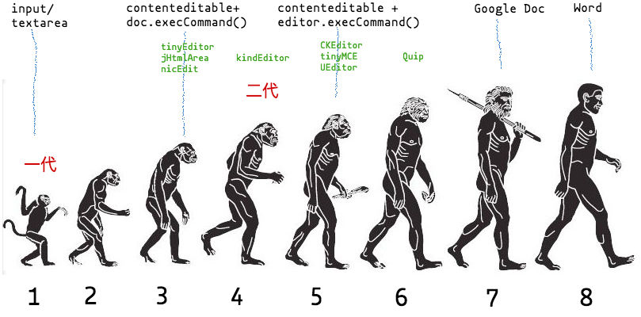

=====

### 第二代编辑器的问题

* `doc.execCommand()` 不可控
* HTML灵活, 格式丰富
* 难于内嵌非contenteditable内容


=====

### 期望

* 解决第二代编辑器的问题
* 为编辑而生
* 强大的扩展性
    - 丰富的功能
    - 协同编辑
    - 分页

=====

### 前期调研

* Google Docs
* [Etherpad](https://en.wikipedia.org/wiki/Etherpad)
    - [etherpad-lite](https://github.com/ether/etherpad-lite)
* [Quip](https://quip.com/)

=====

## [Quip](https://quip.com/)

=====

## 协同表格

<p style="text-align: center; font-size: 24px;">王跃(wangyue)<p>

=====

## BulbEditor架构

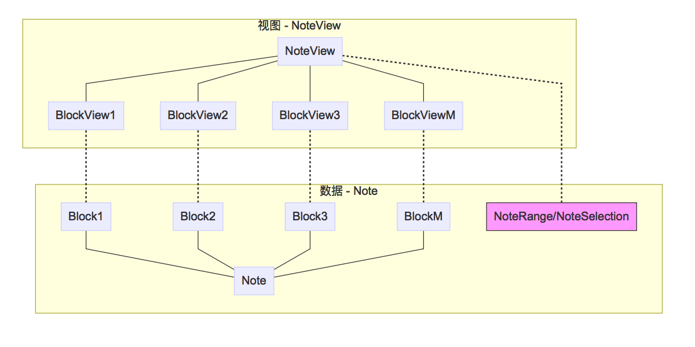

<div style="text-align:center;background-color: #CCC; color: #333; border: 1px solid #333; font-size: 32px; padding: 10px 0;">XML 存储</div>


=====

## 数据抽象

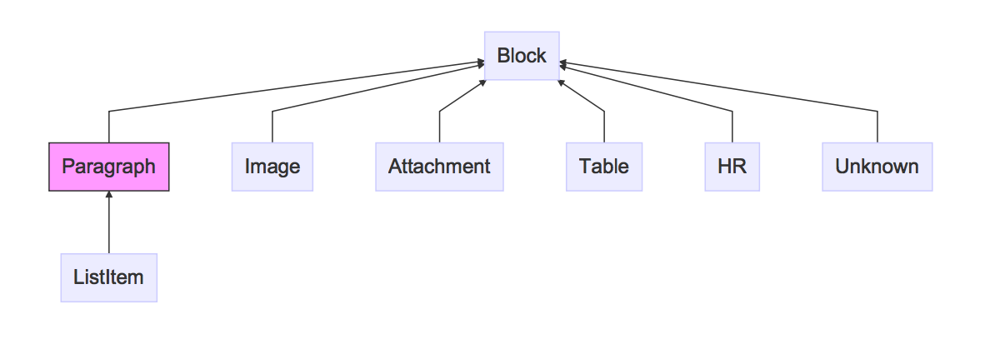

=====

## Paragraph

=====

## Paragraph - 存储层

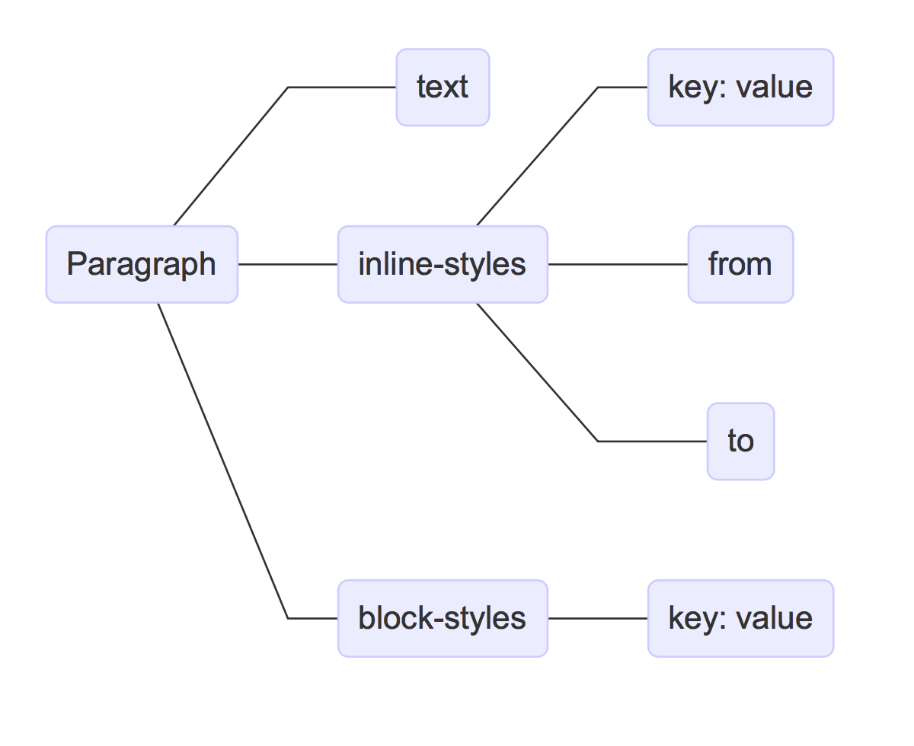

=====

<h2 style="text-decoration:line-through;font-weight: normal;">B<span style="color:red;background-color:yellow">u</span>lb</h2>

```xml
<para>
    <text>Bulb</text>               <!-- 内容 -->
    <inline-styles>                 <!-- inline styles -->
        <strike>
            <from>0</from>
            <to>4</to>
            <value>true</value>
        </strike>
        <color>
            <from>1</from>
            <to>2</to>
            <value>#FF0000</value>
        </color>
        <back-color>
            <from>1</from>
            <to>2</to>
            <value>#FFFF00</value>
        </back-color>
    </inline-styles>
    <styles>                        <!-- block styles -->
        <align>center</align>
    </styles>
</para>

```

=====

## Paragraph - 数据层

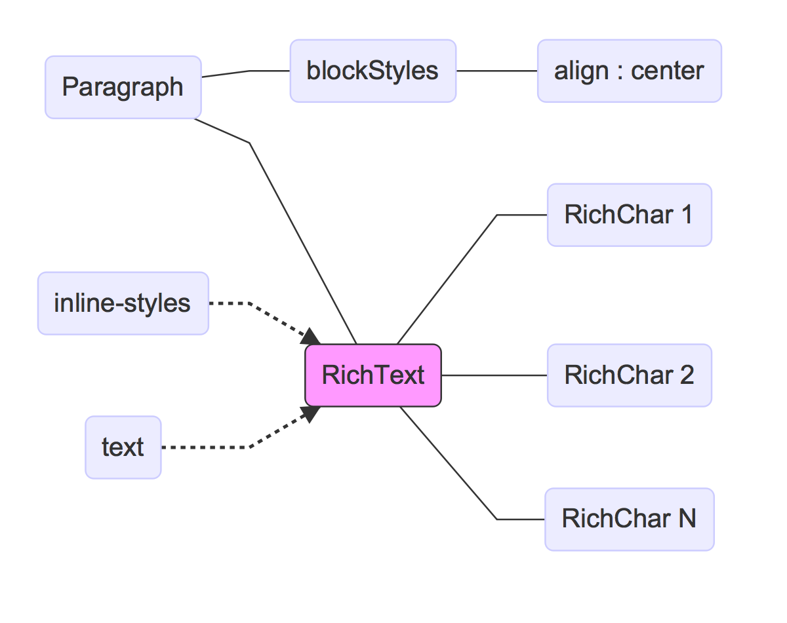

=====

<h2 style="text-decoration:line-through;font-weight: normal;">B<span style="color:red;background-color:yellow">u</span>lb</h2>

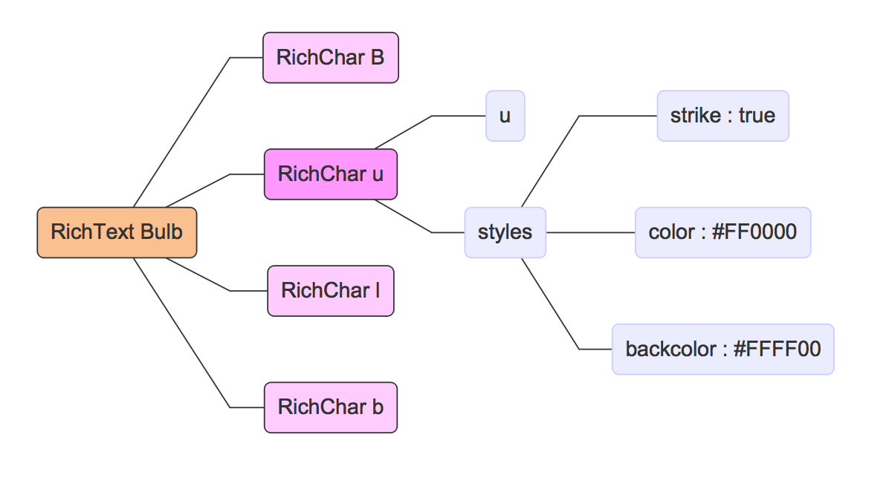

=====
## ParagraphRange

=====

## Paragraph - 视图层

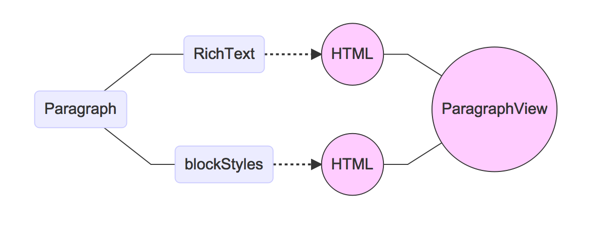

=====

<h2 style="text-decoration:line-through;font-weight: normal;">B<span style="color:red;background-color:yellow">u</span>lb</h2>

```xml
<div class="block-view paragraph-view"> <!-- wrapper -->
    <div class="para-text" style="text-align: center;"> <!-- block styles -->
        <!-- rich text START -->
        <span style="text-decoration:line-through">
            B
        </span>
        <span style="color:#FF0000;background-color:#FFFF00;text-decoration:line-through">
            u
        </span>
        <span style="text-decoration:line-through">
            lb
        </span>
        <!-- rich text END -->
    </div>
</div>

```

=====

# Command

=====

## MVC


=====

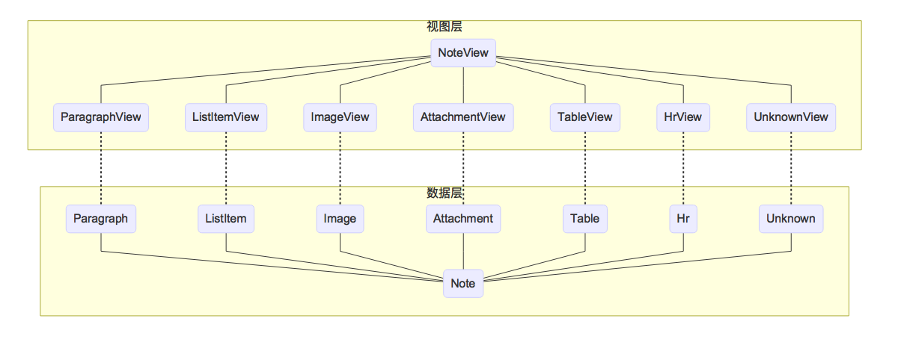

=====

## MVC
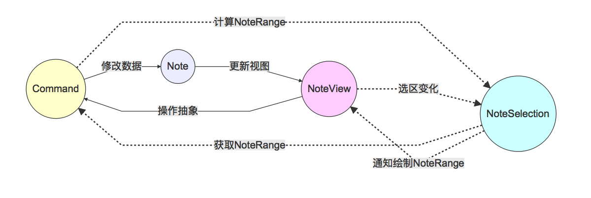

=====
## Command 计算Range

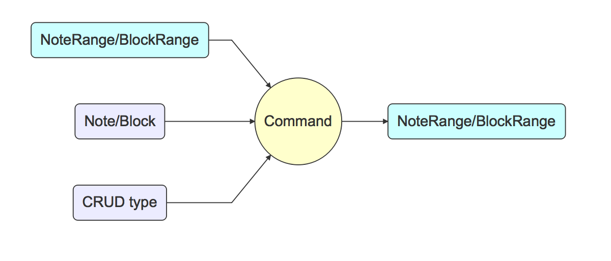

=====

## Command Undo/Redo
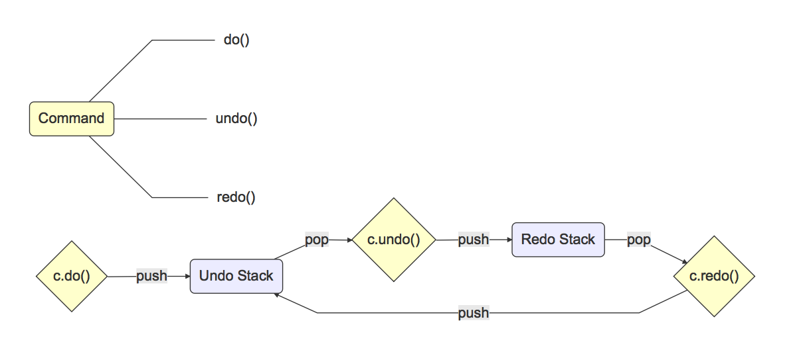

=====

### Command Undo/Redo

Gif 动画

=====

### 第二代编辑器的问题

* `doc.execCommand()` 不可控
* HTML灵活, 格式丰富
* 难于支持非contenteditable内容

=====

### 优点

* 数据/视图分离
* 数据易处理
* 可控
* 扩展性强


<p class="hint-details">
可控 -> 丢弃 document.execCommand(), 显示时字体优化
扩展性强 -> 内嵌mini app (如table), 协同编辑

</p>

=====

### 缺点

* 复杂, 不易实现
* 开发成本高
* 排版引擎缺失
* 性能下降

=====

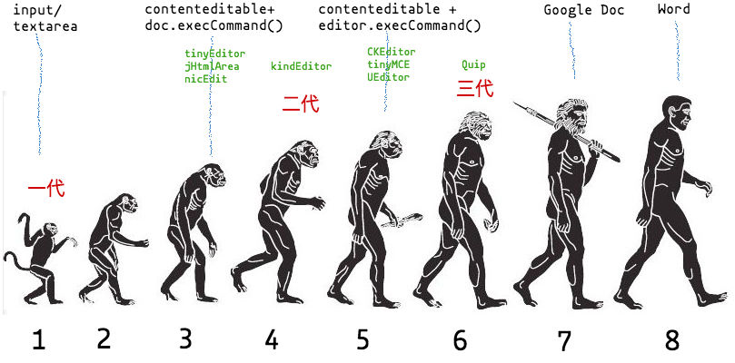

=====

<h1 style="font-family: monospace;">THANK YOU</h1>
