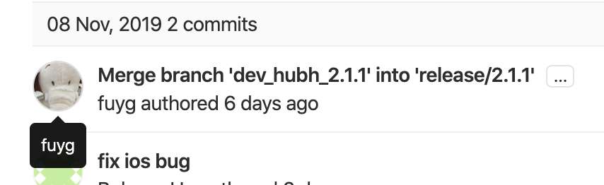
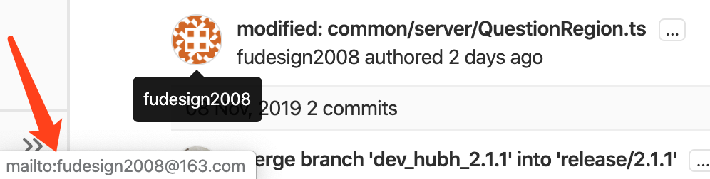
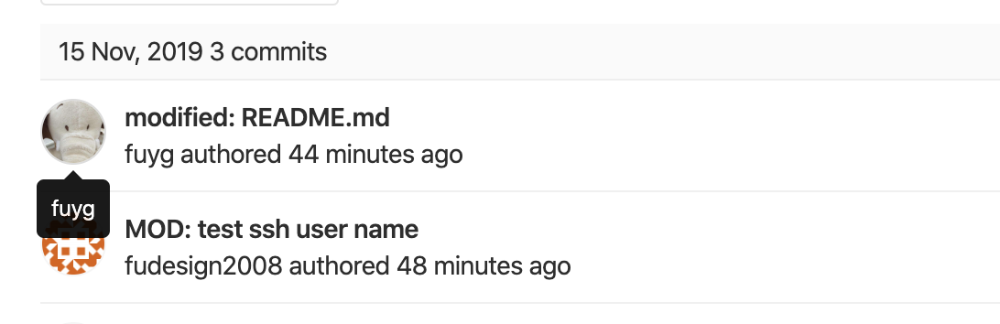

### Gitlab/GitHub 上配置 ssh key

=====

## 一般步骤

1. [生成 ssh key](https://help.github.com/en/enterprise/2.15/user/articles/generating-a-new-ssh-key-and-adding-it-to-the-ssh-agent)
    - macOS: `ssh-keygen -t rsa -C "your.email@example.com" -b 4096`
1. 添加至 Gitlab/Github
    - macOS: `pbcopy < ~/.ssh/id_rsa.pub`
    - Gitlab/GitHub 中操作

=====

## 多账户支持

=====

### 多账户

-   不同的 Gitlab/GitHub 账号
-   不同账号使用不同的 ssh key

=====

### 支持

-   生成多个 ssh key
-   配置 config

=====

```config
# macOS: `~/.ssh/config`

#activehacker account
Host github.com-activehacker
    HostName github.com
    User git
    IdentityFile ~/.ssh/id_rsa_activehacker

#jexchan account
Host github.com-jexchan
    HostName github.com
    User git
    IdentityFile ~/.ssh/id_rsa_jexchan

```

=====

### 已有 repo

```bash
cd ~/path/to/repo
git config user.name "jexchan"
git config user.email "jexchan@gmail.com"

```

=====

## 案例

=====



=====



=====

### 解决步骤

=====

1. ssh 生成检查 ✅
1. 多账户 ssh config 配置检查 ✅
1. `~/.gitconfig` 配置检查 ✅
1. `hw-web` 工程配置 ⚠️

=====

```bash
cd ~/path/to/hw-web
git config user.name "fuyg"
git config user.email "fuyg@xxx.com"

```

=====



=====

### 最佳实践

-   正确配置 ssh
-   自定义头像

=====

## 参考

-   [Generating a new SSH key and adding it to the ssh-agent](https://help.github.com/en/enterprise/2.15/user/articles/generating-a-new-ssh-key-and-adding-it-to-the-ssh-agent)
-   [Adding a new SSH key to your GitHub account](https://help.github.com/en/enterprise/2.15/user/articles/adding-a-new-ssh-key-to-your-github-account)
-   [Multiple SSH Keys settings for different github account](https://gist.github.com/jexchan/2351996)
