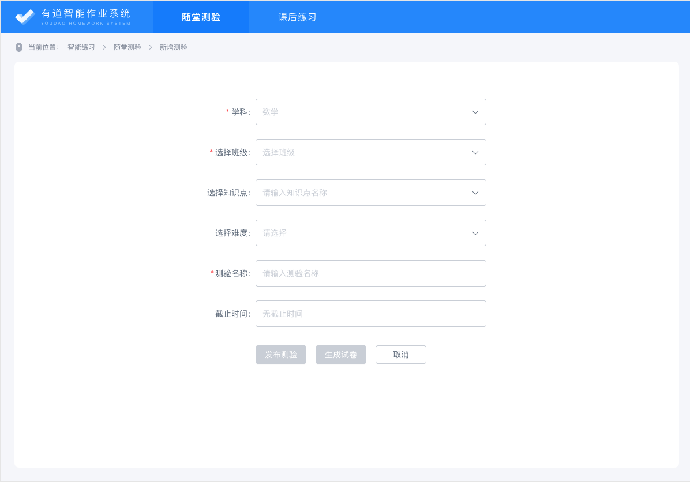
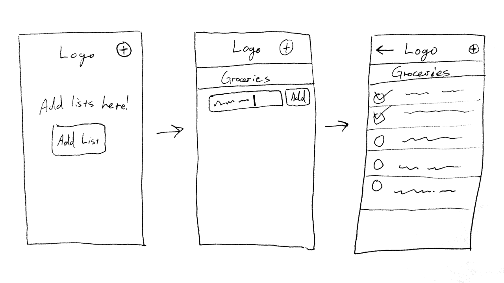

# 代码的模块划分与复用

=====

## DRY

---

`Don't Repeat Yourself`

---

The Pragmatic Programmer

(程序员修炼之道：从小工到专家)

=====

## Divide and Conquer

---

分而治之

---

1. 分/Divide (模块划分) ⭐️
1. 治/Conquer (功能实现)

=====

## UI 层模块划分

---

---

### Start with a Pencil and Paper

---

=====

## 代码层模块划分

---

### Vue

1. 页面(`page`)
1. 界面(`view`)
1. 组件(`Component`)
1. Mixin (不推荐)

---

### JS/TS

1. 库/框架 (`day.js`/`Vue`)
1. 文件 (`*.js`/`*.ts`)
1. 类 (`class`)
1. 函数 ( `function` )
1. 常量/变量

---

### CSS

SCSS / Less

---

以 SCSS 为例

1. 文件 (`@import`)
1. 类 (`@extend`/`@mixin`)
1. 函数 (`@function`)
1. [变量 (Variable)](https://sass-lang.com/documentation/variables)

=====

## 参考资料

1. [Don't repeat yourself - Wikipedia](https://en.wikipedia.org/wiki/Don%27t_repeat_yourself)
1. [How I Rapidly Prototype Websites | Treehouse Blog](https://blog.teamtreehouse.com/rapidly-prototype-websites)
